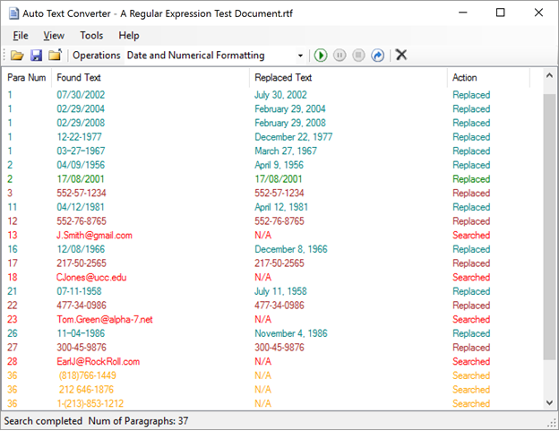
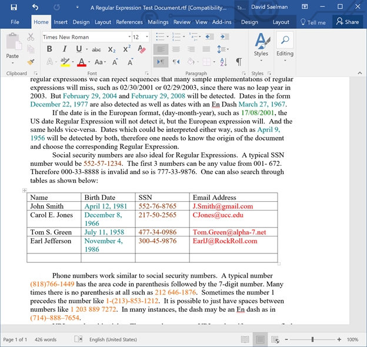

# AutoTextConverter
Auto Text Converter Source Code

1.	Introduction

1.1	Purpose 
The Auto Text Converter is a powerful search-and-replace tool for Microsoft Word Documents. It utilizes regular expressions, a feature missing in standard MS Office installations, as the heart of its search-and-replace engine.
With this application one can accomplish such tasks as capturing all of the URLs in a document, converting words of British spelling 
into their American equivalents and vice-versa. The application comes with  number of pluggins for text validation and replacements.
New plugins can be written and added to the plugins directory.
The search and replace abilities are only limited by one’s imagination.
  
1.2	Key Features
This document is intended for developers 
•	Automated or manual controlled searching and or text replacements.
•	Exporting the list of searched entries to a text or EXCEL file.
•	The inclusion of several plugins which are used to extend the ability to perform sophisticated text replacements such as converting a date format, e.g., 3/17/2016 into March 17, 2016.
•	The ability of writing your own plugins and adding them to the application.
•	The ability of reviewing all the changes that were made during a search-and-replace session and choosing to either revert or commit that change.
•	One can instantly navigate to any search result by simply double-clicking the entry in the application list view.
•	And many more options.

1.3	Requirements
Before running the application please read, understand, and agree to the following:

THE SOFTWARE IS PROVIDED "AS IS", WITHOUT WARRANTY OF ANY KIND, EXPRESS OR IMPLIED, INCLUDING BUT NOT LIMITED TO THE WARRANTIES OF MERCHANTABILITY, FITNESS FOR A PARTICULAR PURPOSE AND NONINFRINGEMENT. IN NO EVENT SHALL THE SaelSoft or David Saelman BE LIABLE FOR ANY CLAIM, DAMAGES OR OTHER LIABILITY, WHETHER IN AN ACTION OF CONTRACT, TORT OR OTHERWISE, ARISING FROM, OUT OF OR IN CONNECTION WITH THE SOFTWARE OR THE USE OR OTHER DEALINGS IN THE SOFTWARE.

The following must be present on your PC in order to run the application:

•	Operating System: WIN XP SP3, VISTA, Windows 8, 8.1, 10

•	.NET 4.0

•	Microsoft WORD 2007, 2010, 2013, 2016

2.	Overview

Below is a picture of the main application GUI:

The tool bar shows the following function buttons (from left to right)

Open file
Save file
Close file
Operations COMBO box 
Auto process button
Pause button
Stop button
Step button
Clear the Listview button

3.	Operation

3.1	Running the Application

After starting the application, the user can choose one of several search profile XML files from the Operations combobox.  By going to the View->  After opening the file with the application, the user can press the <process> button and the application will search paragraph by paragraph for a match.  The processing can be paused or resumed by pressing the <pause> button.  Pressing the <stop> button will stop the processing. 

3.2	Running Modes

One can process the file in one of two mode: (1) Process mode, which will process the entire file automatically. (2) Step mode, which will stop at each change. The user then needs to hit the step button again and the program will proceed until the next change.  The user can change modes simply by pressing the <Pause> button and pressing the mode of their choice.  

Below is a screenshot of a processed WORD document"

